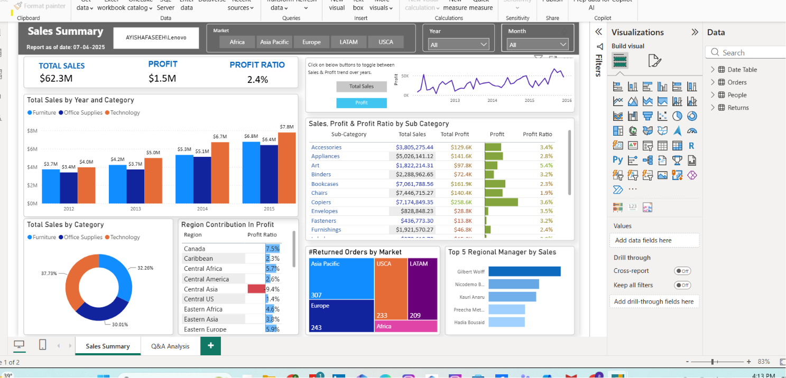

# Global Superstore Sales Analysis Dashboard

Power BI dashboard analyzing global retail sales performance across markets, regions, categories, and regional managers, built on the widely-used Global Superstore dataset.



## Business Problem
A global retail chain operating across multiple markets (Africa, Asia Pacific, Europe, LATAM, USCA) needs a consolidated view of sales, profit, and profitability by category, sub-category, and region — along with visibility into returns and regional manager performance — to guide category strategy and regional resource allocation.

## Dataset
Global Superstore dataset (public), covering order-level transactions from 2012–2015 across:
- Market (Africa, Asia Pacific, Europe, LATAM, USCA) and Region
- Category & Sub-Category (Furniture, Office Supplies, Technology, and their sub-categories)
- Sales, Profit, Profit Ratio
- Order returns
- Regional Sales Managers

## Dashboard Pages
1. **Sales Summary** — Total Sales, Profit, and Profit Ratio KPI cards; sales trend by year and category; sales/profit trend over time; sales/profit/profit ratio by sub-category table; category contribution donut chart; region contribution to profit table; returned orders by market; top 5 regional managers by sales
2. **Q&A Analysis** — Power BI natural-language Q&A page for ad hoc exploration of the dataset

## Key Metrics Shown
- **Total Sales**: $62.3M
- **Total Profit**: $1.5M
- **Profit Ratio**: 2.4%

## Key DAX Measures
```dax
Total Sales = SUM(Orders[Sales])

Total Profit = SUM(Orders[Profit])

Profit Ratio = DIVIDE([Total Profit], [Total Sales], 0)

Returned Orders Count =
CALCULATE(DISTINCTCOUNT(Orders[Order ID]), Returns[Returned] = "Yes")

Region Profit Ratio =
DIVIDE(
    CALCULATE([Total Profit]),
    CALCULATE([Total Sales])
)
```

## Key Insights (example narrative for interviews)
- Technology consistently leads sales by category and year, but profit ratio varies significantly by sub-category — Copiers and Accessories show strong profitability while others lag.
- Sales grew year-over-year from 2012–2015, with 2015 showing the highest combined sales figure across categories.
- Returns are concentrated in specific markets (Asia Pacific, USCA), which is a useful flag for supply chain or quality investigation.
- Regional manager performance varies meaningfully by sales volume, useful for identifying coaching or resourcing needs.

## Tools Used
Power BI Desktop, DAX, Power Query (M), Power BI Q&A (natural language query feature)

## Files in This Folder
- `Superstore_Sales_Analysis_Dashboard-ayishafaseeh.pbix` — the full Power BI file
- `Superstore_sales_dashboard.png` — dashboard screenshot
- `README.md` — this file
